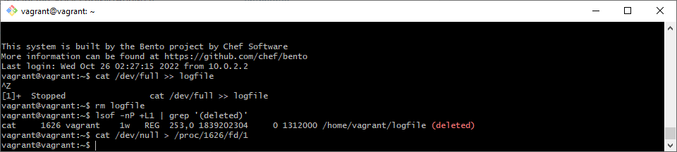

### Задание 1 ###
    chdir("/tmp") 
### Задание 2 ###
    Команды проверил
    vagrant@vagrant:~$ file /dev/tty
    /dev/tty: character special (5/0)
    vagrant@vagrant:~$ file /dev/sda
    /dev/sda: block special (8/0)
    vagrant@vagrant:~$ file /bin/bash
    /bin/bash: ELF 64-bit LSB shared object, x86-64, version 1 (SYSV), dynamically linked, interpreter /lib64/ld-linux-x86-64.so.2, BuildID[sha1]=2a9f157890930ced4c3ad0e74fc1b1b84aad71e6, for GNU/Linux 3.2.0, stripped
    
    Ответ:
    "/usr/share/misc/magic.mgc"
    плюс пытался открыть /etc/magic.mgc
### Задание 3 ###
    vagrant@vagrant:~$ cat /dev/full >> logfile
    vagrant@vagrant:~$ rm logfile
    vagrant@vagrant:~$ lsof -nP +L1 | grep '(deleted)'
    cat     1626 vagrant    1w   REG  253,0 1839202304     0 1312000 /home/vagrant/logfile (deleted)
    vagrant@vagrant:~$ cat /dev/null > /proc/1626/fd/1
    альтернативный вариант 
    vagrant@vagrant:~$ : > /proc/1626/fd/1

    
    
### Задание 4 ###
    Нет, только засоряют список процессов
### Задание 5 ###
    vagrant@vagrant:~$ dpkg -L bpfcc-tools | grep sbin/opensnoop
    /usr/sbin/opensnoop-bpfcc

    PID    COMM               FD ERR PATH
    1072   vminfo              4   0 /var/run/utmp
    734    dbus-daemon        -1   2 /usr/local/share/dbus-1/system-services
    734    dbus-daemon        20   0 /usr/share/dbus-1/system-services
    734    dbus-daemon        -1   2 /lib/dbus-1/system-services
    734    dbus-daemon        20   0 /var/lib/snapd/dbus-1/system-services/
    ^Z
    [2]+  Stopped                 sudo /usr/sbin/opensnoop-bpfcc
### Задание 6 ###
    на второй странице man -a 
    uname - get name and information about current kernel
    Part of the utsname information is also accessible  via  /proc/sys/kernel/{ostype, hostname, osrelease, version, domainname}.
    /proc/sys/kernel/osrelease
### Задание 7 ###
    Оператор точка с запятой позволяет запускать несколько команд за один раз, и выполнение команды происходит последовательно.
    Оператор AND (&&) будет выполнять вторую команду только в том случае, если при выполнении первой команды SUCCEEDS, т.е. состояние выхода первой команды равно «0» — программа выполнена успешно.
    Не имеет смысла. set - e - Выполняется немедленно, если команда завершается с ненулевым статусом выхода.
### Задание 8 ###
    e - Выполняется немедленно, если команда завершается с ненулевым статусом выхода.
    u - Обрабатывает неустановленные переменные как ошибку при подстановке.
    x - Выводит команды и их аргументы по мере их выполнения.
    o pipefail - Не завершается до тех пор, пока не будут завершены все компоненты, а статус выхода это значение последней команды для выхода, с ненулевым статусом выхода или равно нулю, если все команды возвращают нулевой статус выхода.
### Задание 9 ###
    vagrant@vagrant:~$ ps -o stat
    STAT
    Ss - прерываемый сон (ожидание события), (s) является лидером сеанса
    R+ - работает или находится в очереди на выполнение, (+) находится в группе процессов переднего плана

    
